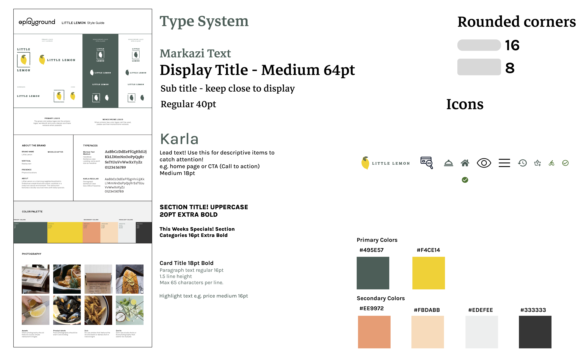
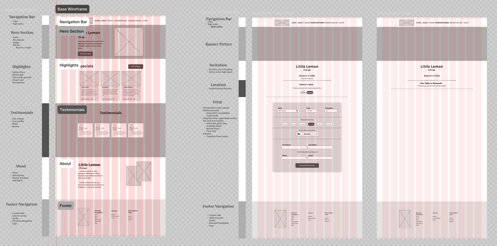
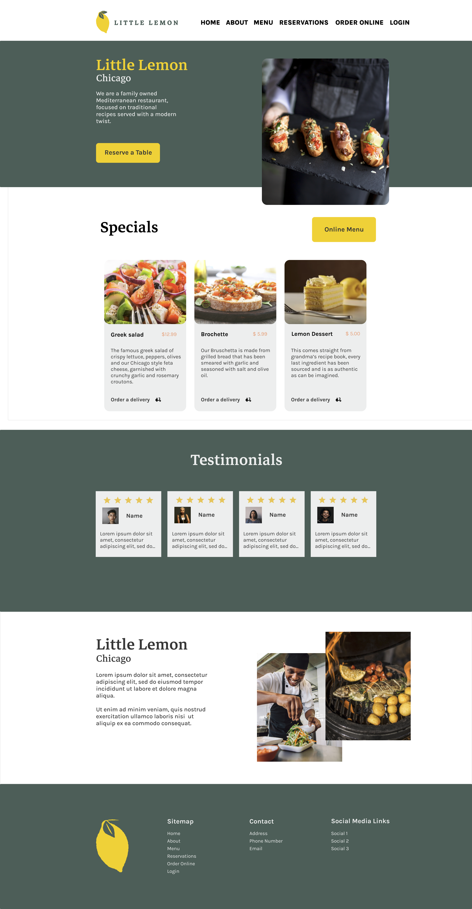
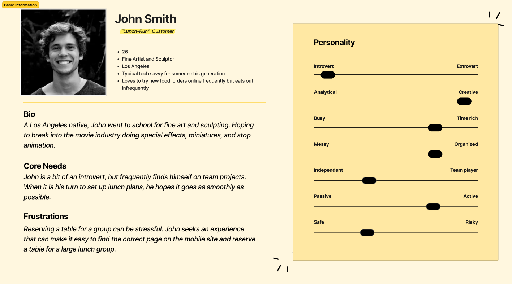
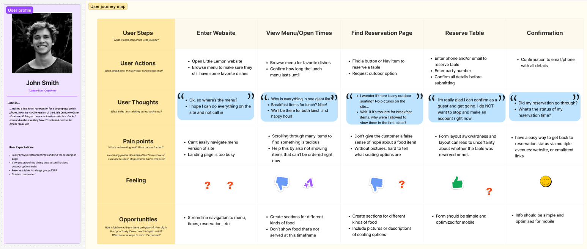

# Little Lemon Restaurant Website

This is my capstone project for Meta's "[Front-End
Developer](https://www.coursera.org/professional-certificates/meta-front-end-developer)"
course on Coursera. It encompasses designing and building a responsive site, from scratch,
using Figma and React.

### Assignment requirements
* Design and prototype the "Reserve a Table" feature for the Little Lemon restaurant website using Figma. It needs it's own page
  on the main navigation and must have a confirmation page.
* Include designing information architecture, and incorporating text, animations and graphics of branding and content.
* Create a solution to the problem, a persona, a journey map, low-fidelity wireframes and an interactive high-fidelity prototype. 
* Flesh out the provided Figma style & UI guide to help create the site.
* Use appropriate semantic HTML & open graph tags.
* Make the layout responsive to mobile and desktop browsers.
* Make use of state in the booking form; implement client-side validation for
    the interactive date/time picker utilizing [a custom mock
    API](src/utils/api.js)
* Utilize unit tests using [React Testing Library](https://testing-library.com)
    and make sure they all pass successfully.

  

[Figma Files](https://www.figma.com/design/yCXJBfa0KF6xMb5DAngPqg/Final-Project---Little-Lemon?node-id=4-34&node-type=canvas&t=KFz298SxncIjSDHa-0)

---

### Low-fidelity wireframe

  

[Figma Files](https://www.figma.com/design/yCXJBfa0KF6xMb5DAngPqg/Final-Project---Little-Lemon?node-id=1-4&t=DAa47mkDa0MvmJHc-1)

### Interactive high-fidelity prototype

  

[Figma Files](https://www.figma.com/design/yCXJBfa0KF6xMb5DAngPqg/Final-Project---Little-Lemon?node-id=34-115&t=DAa47mkDa0MvmJHc-1)

### Persona

  

[Figma Files](https://www.figma.com/board/3xdjcaQECVhBFwHpUyLP8h/Persona-Page?node-id=0-1&t=DAa47mkDa0MvmJHc-1)

### Customer journey map

  

[Figma Files](https://www.figma.com/board/I43ibcScfR1m8ZbbJFNuba/User-Journey?t=DAa47mkDa0MvmJHc-1)

## About the React App

This project was bootstrapped with [Create React App](https://github.com/facebook/create-react-app).

### Available Scripts

In the project directory, you can run:

* `npm start`
* `npm test`
